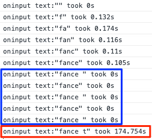
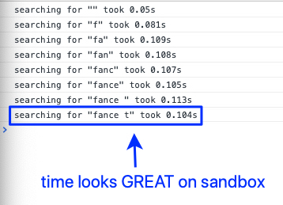

# Search Demo

This sandbox was created to test the integration with our autosuggest package. The package looks fine and the React integration layer also looks fine, however, something bad is making it perform poorly in our app.

## Running the sandbox

All this folder is self contained, meaning that it has no external dependencies. Just run `yarn` to install the packages and `yarn install` to start the sandbox server. The example will automatically open in your default web browser.

## Results

Search times on NTBL app:

Search times on this sandbox:

